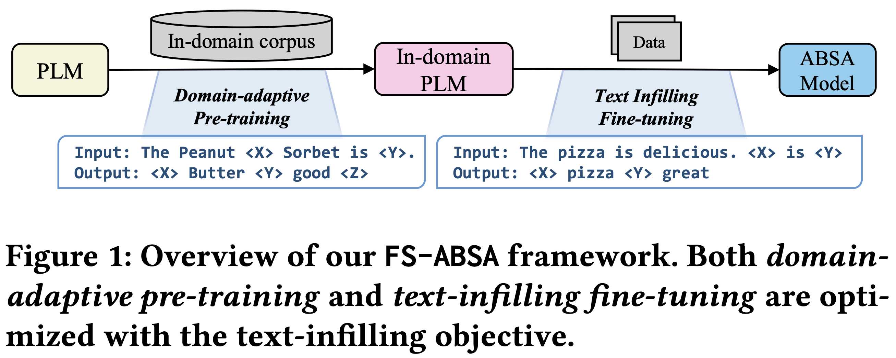
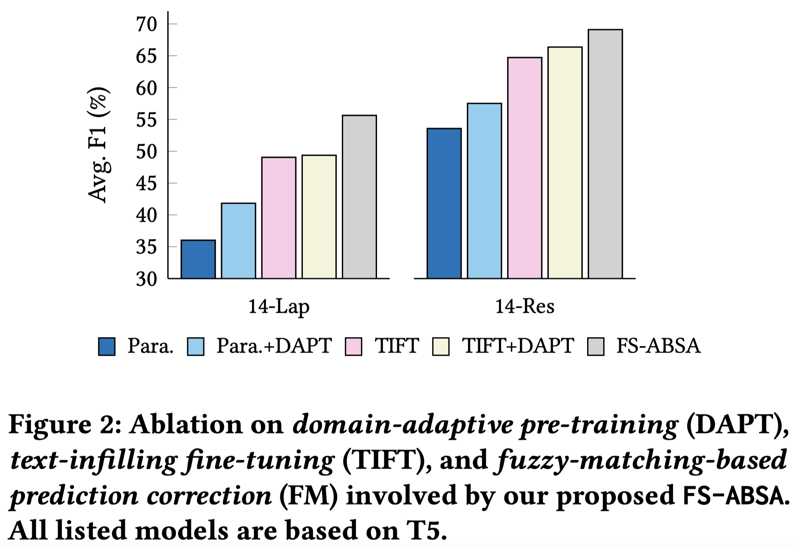

# FS-ABSA: A Simple yet Effective Framework for Few-Shot Aspect-Based Sentiment Analisys 

## Quick links

  - [Overview](#overview)
  - [Requirements](#requirements)
  - [Run FS-ABSA](#run-fs-absa)
    - [Fully-supervised Setting](#fully-supervised-setting)
    - [Non-English Low-resource Setting](#non-english-low-resource-setting)
    - [Ablation Study](#ablation-study)
  - [Any Question?](#any-questions)
  - [Citation](#citation) 

## Overview



In this work, we introduce a simple yet effective framework called **FS-ABSA**, which involves domain-adaptive pre-training and textinfilling fine-tuning.
Specifically, 
- we approach the End-to-End ABSA task as a text-infilling problem. 
- we perform domain-adaptive pre-training with the text-infilling objective, narrowing the two gaps, i.e., domain gap and objective gap, and consequently facilitating the knowledge transfer.

## Requirements

To run the code, please install all the dependency packages by using the following command:

```
pip install -r requirements.txt
```

**NOTE**: All experiments are conducted on NVIDIA RTX 3090 (and Linux OS). Different versions of packages and GPU may lead to different results.

## Run FS-ABSA

**NOTE**: All experiment scripts are with multiple runs (three seeds).

### Fully-supervised Setting

```
## Dataset: 14lap (English)
$ bash script/run_aspe_14lap.sh

## Dataset: 14res (English)
$ bash script/run_aspe_14res.sh
```

### Non-English Low-resource Setting

```
## Dataset: 16res (Dutch)
$ bash script/run_aspe_dutch.sh

## Dataset: 16res (French)
$ bash script/run_aspe_french.sh
```

### Ablation Study



## Citation

```


```

## Any Questions?

If you have any questions related to this work, you can open an issue with details or feel free to email Zengzhi(`zzwang@njust.edu.cn`), Qiming(`qmxie@njust.edu.cn`).


## Acknowledgements

Our code is based on [ABSA-QUAD](https://github.com/IsakZhang/ABSA-QUAD). Thanks for their work.

